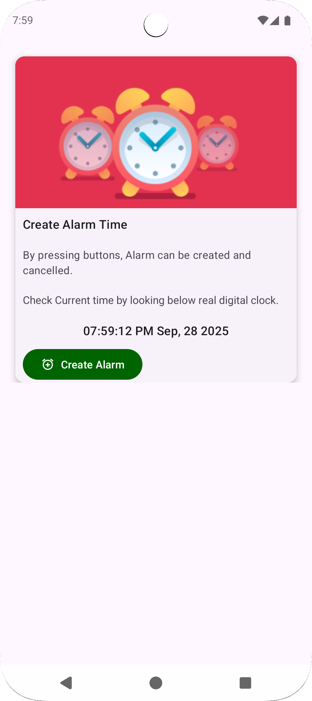
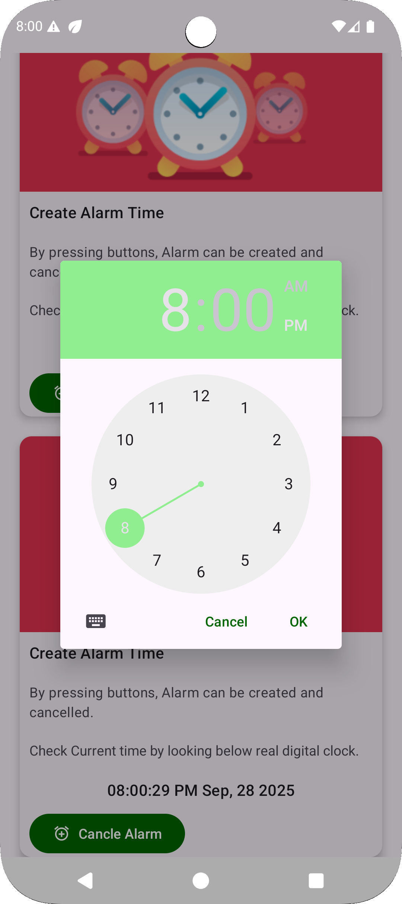
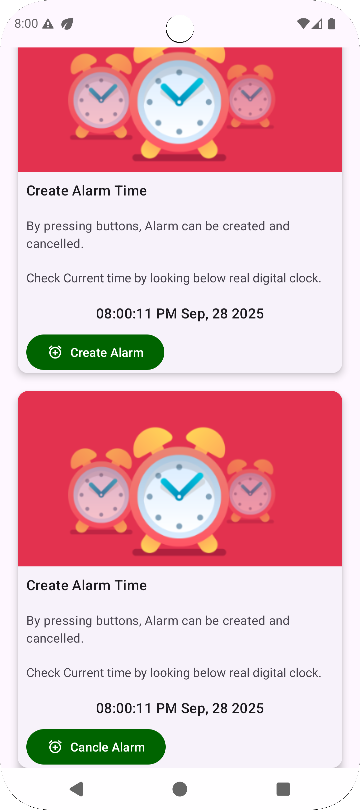

# Practical 4 — Alarm with Foreground Service (Kotlin)

A simple Android app that lets you pick a time for an alarm. When it fires, a foreground service starts, shows a high-priority notification, and plays a looping alarm sound until you cancel it.

## What you do
- Tap "Create Alarm" and pick a time.
- See the scheduled time card appear.
- To stop/cancel, tap "Cancel Alarm".

## How it works (high level)
- MainActivity opens a TimePicker and schedules an exact alarm via AlarmManager using a PendingIntent to a BroadcastReceiver.
- AlarmBroadcastReceiver receives the broadcast and starts/stops AlarmServices. On Android O+ it uses startForegroundService for compliance.
- AlarmServices is a foreground service. It:
  - Creates a notification channel (O+),
  - Shows an ongoing high-priority notification,
  - Plays the default alarm ringtone in a loop with MediaPlayer,
  - Stops and cleans up when told to.

## Permissions and OS specifics
- Exact alarms: Manifest declares SCHEDULE_EXACT_ALARM. On Android 12+ (S/31), the app may ask you to allow exact alarms in system settings.
- Notifications: On Android 13+ (T/33), the app requests POST_NOTIFICATIONS at runtime so the foreground notification can appear.

## Build & run
- SDK: minSdk 24, targetSdk/compileSdk 36.
- Open the project in Android Studio (Giraffe or newer recommended) and run on a device/emulator with audio output.
- First run on Android 12+ may prompt for exact alarms; on Android 13+ will prompt for notifications.

## Components in this project
- MainActivity.kt — UI and alarm scheduling (setExactAndAllowWhileIdle for API 23+).
- AlarmBroadcastReceiver.kt — Bridges AlarmManager to the service, starts/stops it safely across Android versions.
- AlarmServices.kt — Foreground service that shows the notification and plays the alarm tone.
- AndroidManifest.xml — Declares the service/receiver and exact alarm permission.

## Notes & tips
- If you pick a past time today, the app schedules it for the next day automatically.
- Alarms aren’t re-scheduled across reboots in this sample.
- If you don’t hear sound, raise the alarm/notification volume on the device.

## Screenshot

  
  
  

